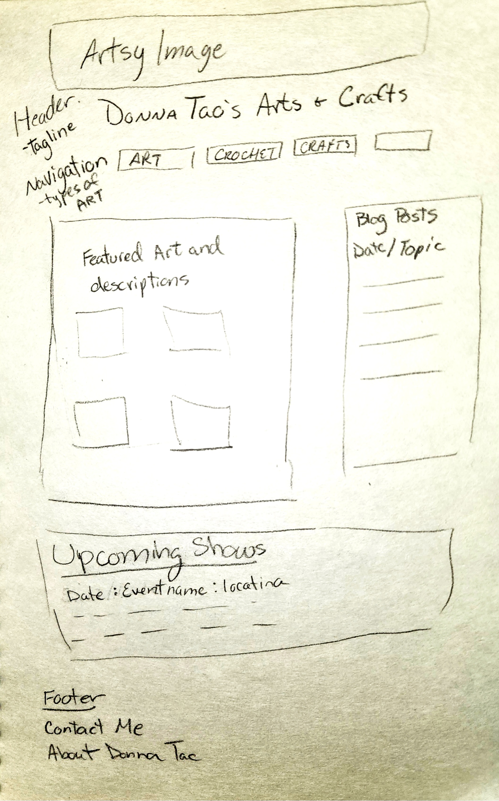
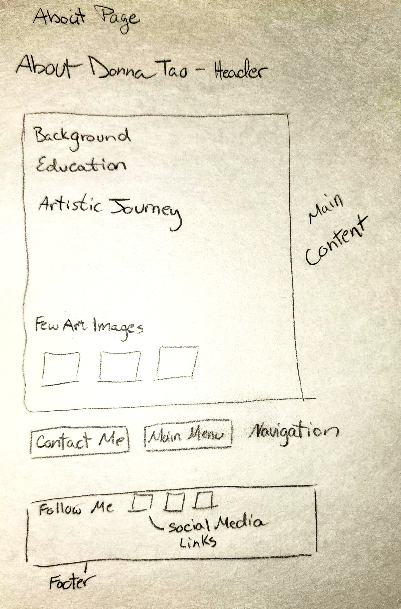
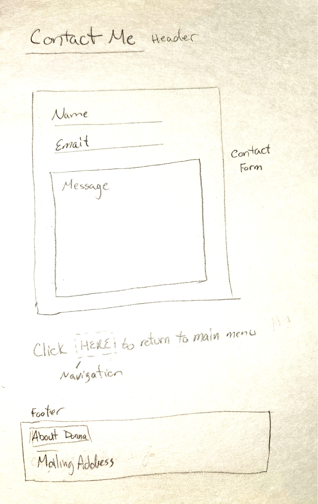

# Donna Lyle arts and crafts portfolio

A site capturing my hobby created arts and crafts

## Wireframes

Here are some wireframes to show the potential flow and organization of the site.

Header - will include a decorative image, my name with a possible tagline and navigation menu

Navigation menu - will include links to other pages featuring different types of crafts

Main content - will include a few hightlighted pieces of artwork and a blog post call outs with links. Below that will be a section for any future craft show appearances.

Footer - will include links to about me and contact page

Header - will contain a title for the page and possibly a general image

Main Content - will include background information and a few craft creation images

Navigation - will include links to the contact page and back to home page

Footer - will include links to follow me on different social media sitess

Header - to include a title of the page

Main Content - will containe a contact form that can be filled in

Navigation - to include a link to get back to the main page

Footer - to inclue link to the about me page as well as my contact mailing address